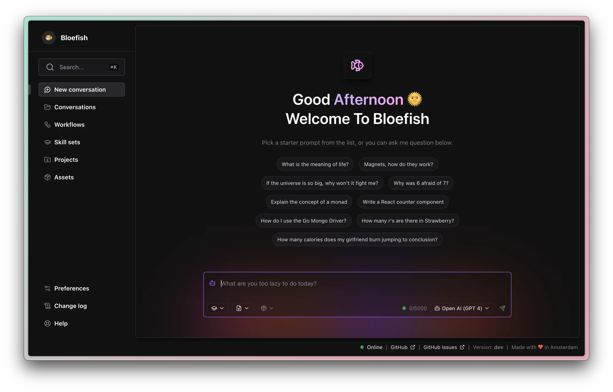

# 🐡 Bloefish


## Kinda important notice

The `master` branch should not be expected to be stable until this notice is removed. If it breaks, just keep hopping back commits, one of them will work, eventually.

## Introduction

Bloefish is a local AI framework, aiming to provide a simple way to interact with various
AI models and providers, via a few simple to use touch points.

<p align="center">
	<picture>
		<source media="(prefers-color-scheme: dark)" srcset="assets/screenshot-dark.webp" type="image/webp">
		<source media="(prefers-color-scheme: light)" srcset="assets/screenshot-light.webp" type="image/webp">
		
	</picture>
</p>

## Services

| Service        | Port   | Description                                                         | Readme                                    |
| -------------- | ------ | ------------------------------------------------------------------- | ----------------------------------------- |
| `ai_relay`     | `4003` | Handles relaying requests to various AI models and providers.       | [View](./services/airelay/README.md)      |
| `conversation` | `4002` | Handles the creation and management of interactions (messages).     | [View](./services/conversation/README.md) |
| `file_upload`   | `4005` | Handles management and uploading of files.                           | [View](./services/fileupload/README.md)    |
| `skill_set`    | `4006` | Handles creating and management of skill sets.                      | [View](./services/skillset/README.md)     |
| `stream`       | `4004` | Handles streaming.                                                  | [View](./services/stream/README.md)       |
| `user`         | `4001` | Handles the creation and management of users.                       | [View](./services/user/README.md)         |

## Applications

| Application | Port   | Description                                                         | Readme                               |
| ----------- | ------ | ------------------------------------------------------------------- | -----------------------------------  |
| `web`       | `5000` | A web application for interacting with Bloefish's backend.           | [View](./applications/web/README.md) |
| `cli`	      | `N/A`  | A command line interface for interacting with Bloefish's backend.    | [View](./applications/cli/README.md) |

Bloefish also exposes a full RPC API, which Bloefish itself uses, which can be used. Each
backend service exposes a full readme, and an API definition can be found [here](./beak).

## Usage

### Requirements

- Docker
- Golang
- Node.js

To run the project, fire the following commands into your terminal:

```
# App DNS
$ echo "127.0.0.1 app.bloefish.local" | sudo tee -a /etc/hosts

# Service DNS
$ echo "127.0.0.1 svc_ai_relay.bloefish.local" | sudo tee -a /etc/hosts
$ echo "127.0.0.1 svc_conversation.bloefish.local" | sudo tee -a /etc/hosts
$ echo "127.0.0.1 svc_file_upload.bloefish.local" | sudo tee -a /etc/hosts
$ echo "127.0.0.1 svc_skill_set.bloefish.local" | sudo tee -a /etc/hosts
$ echo "127.0.0.1 svc_stream.bloefish.local" | sudo tee -a /etc/hosts
$ echo "127.0.0.1 svc_user.bloefish.local" | sudo tee -a /etc/hosts

# Utility DNS
$ echo "127.0.0.1 grafana.bloefish.local" | sudo tee -a /etc/hosts
$ echo "127.0.0.1 util_telemetry.bloefish.local" | sudo tee -a /etc/hosts
$ echo "127.0.0.1 storageminio" | sudo tee -a /etc/hosts

# Get the project going
$ make install
$ make build
$ make start
$ open http://app.bloefish.local:4169/
```
